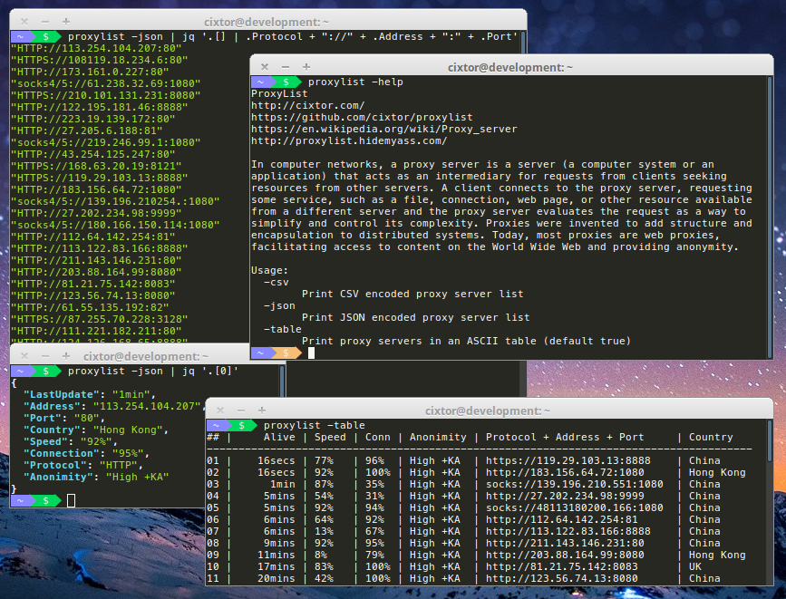

### ProxyList — Print Usable Proxy Servers

> In computer networks, a proxy server is a server (a computer system or an application) that acts as an intermediary for requests from clients seeking resources from other servers. A client connects to the proxy server, requesting some service, such as a file, connection, web page, or other resource available from a different server and the proxy server evaluates the request as a way to simplify and control its complexity. Proxies were invented to add structure and encapsulation to distributed systems. Today, most proxies are web proxies, facilitating access to content on the World Wide Web and providing anonymity.
>
> — https://en.wikipedia.org/wiki/Proxy_server

### Features

- [x] `-csv` - Export data using CSV format to standard output,
- [x] `-json` - Export data using JSON format to standard output,
- [x] `-table` - Export data using ASCII format to standard output,
- [x] `-sort=connection` - Sort data in descending order by the connection,
- [x] `-sort=anonymity` - Sort data in ascending order by the anonymity,
- [x] `-sort=protocol` - Sort data in ascending order by the protocol,
- [x] `-sort=speed` - Sort data in descending order by the speed,
- [x] `-sort=port` - Sort data in ascending order by the port,



```
The MIT License (MIT)

Copyright (c) 2016 CIXTOR

Permission is hereby granted, free of charge, to any person obtaining a copy
of this software and associated documentation files (the "Software"), to deal
in the Software without restriction, including without limitation the rights
to use, copy, modify, merge, publish, distribute, sublicense, and/or sell
copies of the Software, and to permit persons to whom the Software is
furnished to do so, subject to the following conditions:

The above copyright notice and this permission notice shall be included in all
copies or substantial portions of the Software.

THE SOFTWARE IS PROVIDED "AS IS", WITHOUT WARRANTY OF ANY KIND, EXPRESS OR
IMPLIED, INCLUDING BUT NOT LIMITED TO THE WARRANTIES OF MERCHANTABILITY,
FITNESS FOR A PARTICULAR PURPOSE AND NONINFRINGEMENT. IN NO EVENT SHALL THE
AUTHORS OR COPYRIGHT HOLDERS BE LIABLE FOR ANY CLAIM, DAMAGES OR OTHER
LIABILITY, WHETHER IN AN ACTION OF CONTRACT, TORT OR OTHERWISE, ARISING FROM,
OUT OF OR IN CONNECTION WITH THE SOFTWARE OR THE USE OR OTHER DEALINGS IN THE
SOFTWARE.
```
